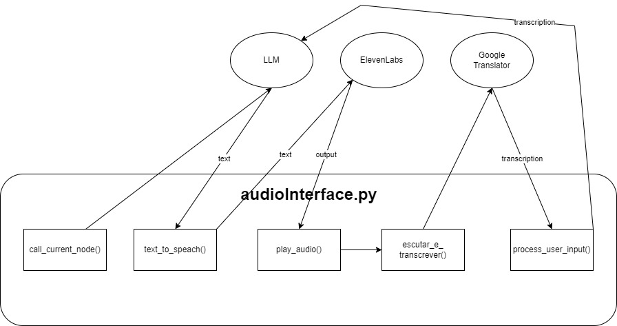

# Lord

Este projeto consiste em duas interfaces principais: uma interface de áudio para interações com um agente conversacional e uma interface de chatbot para o WhatsApp Web. Abaixo estão descritos os principais arquivos do projeto, suas funções e dependências.

## Arquivos Principais

### audioInterface.py



Este script permite a comunicação com o agente através de comandos de voz. Ele inclui marcadores de tempo para medir a latência das respostas da LLM (Language Model) e do Elevenlabs.

#### Funções Importantes

- `call_current_node()`: Chama o nó atual e obtém sua resposta em string.
- `text_to_speech()`: Transforma o texto em áudio.
- `play_audio()`: Reproduz o áudio gerado.
- `escutar_e_transcrever()`: Transforma o áudio em texto.
- `process_user_input()`: Envia o texto para a LLM e, possivelmente, altera o nó atual.

### botmain.py

Este script cria um servidor que, ao receber um número de telefone, abre o WhatsApp Web e conversa com esse número utilizando o agente. O Selenium é extensivamente utilizado neste arquivo.

#### Funções Importantes

- `setup_whatsapp()`: Abre a janela do WhatsApp Web.
- `start_new_conversation()`: Seleciona o contato e abre a janela de conversa.
- `read_last_message()`: Obtém sempre a última mensagem enviada. Existe uma "gambiarra" que adiciona um "!" no final da mensagem se a última mensagem for nova, mas diferente, para garantir a atualização.
- `send_message()`: Envia uma mensagem.
- `save_conversation()`: Salva as conversas em JSON, utilizando o número do contato como nome do arquivo.
- `chat_interaction()`: Realiza todo o processo da conversa, funcionando como o "main" do arquivo.
- `start_chat()`: Inicia o servidor Flask para a rede local.

### script_telefone.py

Este script, ao ser executado com um número específico, envia uma requisição para o servidor criado em `botmain.py` e abre uma instância do WhatsApp Web na máquina que está hospedando o servidor.

### requirements.txt

Lista todas as dependências e suas versões necessárias para o funcionamento do projeto.

## Como Executar

1. **Interface de Áudio**:
   - Execute `audioInterface.py` para iniciar a comunicação com o agente via comandos de voz.

2. **Chatbot WhatsApp Web**:
   - Execute `botmain.py` para iniciar o servidor que gerencia as interações no WhatsApp Web.
   - Execute `script_telefone.py` com o número desejado para iniciar uma nova conversa no WhatsApp Web através do servidor.

## Dependências

Certifique-se de instalar todas as dependências listadas em `requirements.txt` antes de executar os scripts.

```sh
pip install -r requirements.txt
